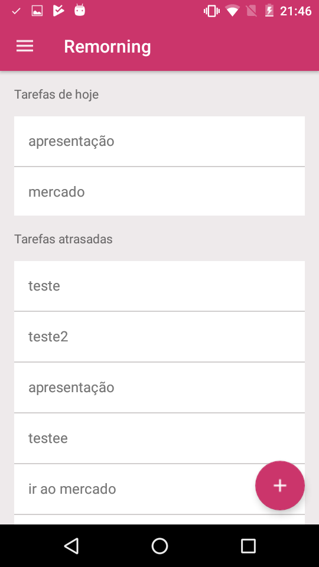
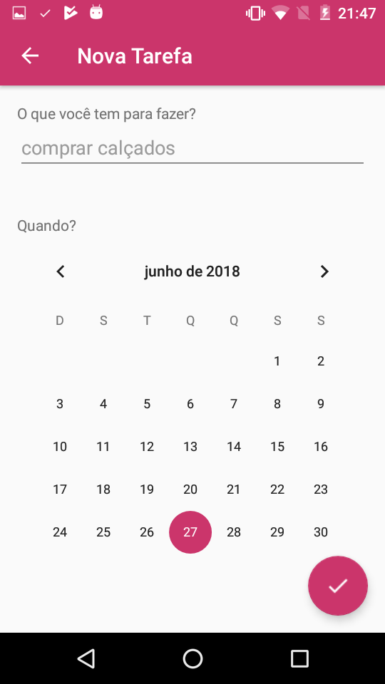
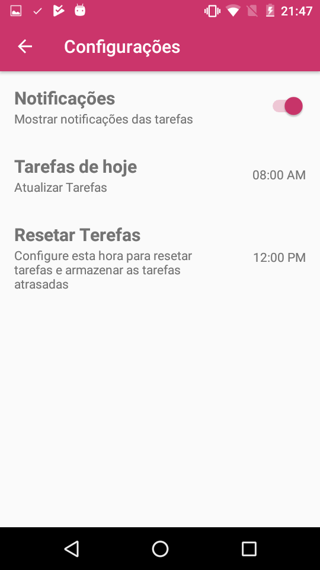

# ReMorning

This is an Android app. ReMorning is a 're'minder in the 'morning' of all tasks the user has in the current date.

The user logs in using a Google account. We use [Firebase](https://firebase.google.com/) to manage our project.

#### This was an assignment for Software Engineering class by Ph.D Alexandre Zanatta at University of Passo Fundo in 2017-1.
